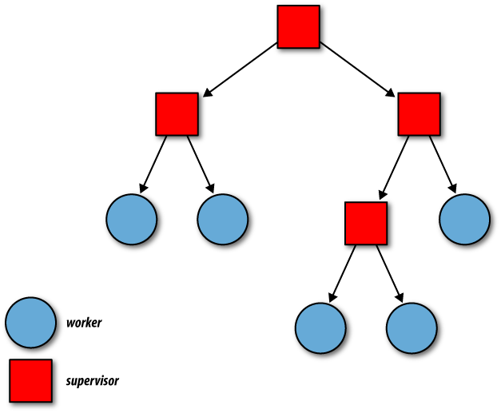

#HSLIDE
## OTP Поведения

#HSLIDE


#HSLIDE
## Съдържание

1. Какво е OTP?
2. GenServer
3. Supervisor
4. Application
5. Bonus - Tasks

#HSLIDE
## Какво е OTP?


#HSLIDE
* OTP е платформата, с която се разпространява Erlang.
* Версиите на Erlang са версии на OTP.  <!-- .element: class="fragment" -->
* OTP е стандартната библиотека на Erlang. <!-- .element: class="fragment" -->
* OTP е Open Telecom Platform, но с времето OTP се е превърнала от платформа за писане на телекомуникационни програми в нещо повече. <!-- .element: class="fragment" -->

#HSLIDE


#HSLIDE
Платформата OTP идва с:
* Интерпретатор и компилатор на Erlang. <!-- .element: class="fragment" -->
* Стандартните библиотеки на Erlang. <!-- .element: class="fragment" -->
* Dialyzer. <!-- .element: class="fragment" -->
* Mnesia - дистрибутирана база данни. <!-- .element: class="fragment" -->
* ETS - база данни в паметта. <!-- .element: class="fragment" -->
* Дебъгер. <!-- .element: class="fragment" -->
* И много други... <!-- .element: class="fragment" -->

#HSLIDE
Ние ще разгледаме три абстракции от OTP:
* GenServer
* Supervisor
* Application

#HSLIDE
## GenServer


#HSLIDE
* GenServer представлява процес.
* Представен е от модул, който предлага функции за различни, често срещани случаи при работа с процеси.

#HSLIDE
Какви функции?
* Функции за синхронна и/или асинхронна комуникация. <!-- .element: class="fragment" -->
* Функции, които се извикват при създаване на процес или преди унищожаването му. <!-- .element: class="fragment" -->
* Функции за нотифициране при грешки и за логване. <!-- .element: class="fragment" -->

#HSLIDE
* Когато комбинираме GenServer-и със Supervisor процеси лесно можем да създадем fault-tolerant система.

#HSLIDE
* С помощта на мета-програмиране GenServer е специален тип поведение.
* Задава callback функции, които имат имплементации по подразбиране. <!-- .element: class="fragment" -->
* За да направим от един модул GenServer, използваме "use GenServer". <!-- .element: class="fragment" -->

#HSLIDE
```elixir
defmodule MyWorker do
  use GenServer
end
```

#HSLIDE
По този начин декларираме, че даден модул ще изпълни поведението GenServer.
Това поведение и логиката около него ни дават следните възможности:
* Да стартираме процес. <!-- .element: class="fragment" -->
* Да поддържаме състояние в този процес. <!-- .element: class="fragment" -->
* Да получаваме request-и и да връщаме отговори. <!-- .element: class="fragment" -->
* Да спираме процеса. <!-- .element: class="fragment" -->

#HSLIDE
### Пример : GenServer и Blogit - Posts component


#HSLIDE
### Поведението GenServer : Callback функции

#HSLIDE
#### init


#HSLIDE
```elixir
@type args :: any
@type state :: any
@type reason :: any
@type timeout :: non_neg_integer

@type init_result ::
  {:ok, state} |
  {:ok, state, timeout | :hibernate} |
  :ignore |
  {:stop, reason}

@spec init(args) :: init_result
```

#HSLIDE
* Можем да приемем init/1 за конструктор на GenServer процеса.
* Тя приема аргументи от какъвто и да е тип и връща състоянието на процеса. <!-- .element: class="fragment" -->
* За множество аргументи можем да използваме списък. <!-- .element: class="fragment" -->

#HSLIDE
* Когато GenServer.start_link/3 се извика с даден модул, ако той дефинира init/1, то тя ще се извика като конструктор.
* Поведението по-подразбиране, което се изпълнява, ако не дефинираме тази функция е, да се използват аргументите като състояние:

#HSLIDE
Ако върнем:
* {:ok, <състояние>}, процесът стартира с това състояние.
* {:ok, <състояние>, timeout-в-милисекунди}, процесът ще стартира със състоянието, и ако не получи съобщение за timeout време, ще получи автоматично съобщение :timeout. <!-- .element: class="fragment" -->
* {:ok, <състояние>, :hibernate}, процесът ще хибернира. <!-- .element: class="fragment" -->

#HSLIDE
Ако върнем:
* :ignore, процесът ще излезе нормално и start_link ще върне :ignore. <!-- .element: class="fragment" -->
* {:stop, reason}, процесът ще излезе с върнатата причина и start_link/3 ще върне {:error, reason}. <!-- .element: class="fragment" -->
* Някой от {:ok, state} вариантите, GenServer.start_link/3 ще върне {:ok, pid}. <!-- .element: class="fragment" -->

#HSLIDE
#### handle_call


#HSLIDE
```elixir
@type from :: {pid, ref}
@type handle_call_result ::
  {:reply, reply, new_state} |
  {:reply, reply, new_state, timeout | :hibernate} |
  {:noreply, new_state} |
  {:noreply, new_state, timeout | :hibernate} |
  {:stop, reason, reply, new_state} |
  {:stop, reason, new_state}
  when reply: term, new_state: term, reason: term

@spec handle_call(request :: term, from, state :: term) ::
  handle_call_result
```

#HSLIDE
* Функциите handle_call се извикват когато GenServer-ът получи съобщение, изпратено от GenServer.call/3.
* Функцията GenServer.call/3 изпраща съобщение до GenServer процес и чака за отговор. <!-- .element: class="fragment" -->
* Това е синхронна комуникация. <!-- .element: class="fragment" -->

#HSLIDE
GenServer.call/3
* Първият ѝ аргумент е pid или име на GenServer процес. <!-- .element: class="fragment" -->
* Вторият - съобщението, което трябва да се изпрати. <!-- .element: class="fragment" -->
* Tретият е timeout в милисекунди. <!-- .element: class="fragment" -->

#HSLIDE
* Ако върнем с {:reply, <отговор>, <състояние>}, ще върнем отговорът като резултат на GenServer.call\3 и ще продължим със състоянието, което връщаме.
* Можем да очакваме подобно на init/1 поведение ако timeout или :hibernate са част от резултата.

#HSLIDE
* Ако отговорът е noreply, процесът извикал GenServer.call/3 няма да получи отговор и ще чака.
* Всеки процес може да отговори с GenServer.reply(from, reply).
* Нужно е само "from" да е точно тази наредена двойка, която е получена в handle_call.

#HSLIDE
Има три основни причини да върнем noreply от handle_call:
1. Защото сме отговорили с GenServer.reply/2 преди да върнем резултат. <!-- .element: class="fragment" -->
2. Защото ще отговори след като handle_call е свършила изпълнението си. <!-- .element: class="fragment" -->
3. Защото някой друг процес трябва да отговори. <!-- .element: class="fragment" -->

#HSLIDE
* Връщаме :stop резултат, когато искаме да прекратим изпълнението на GenServer процеса.
* Ще се извика terminate(reason, state) ако е дефинирана и процесът ще прекрати изпълнение с причина, дадената причина.

#HSLIDE
#### handle_cast


#HSLIDE
```elixir
@spec handle_cast(request :: term, state :: term) ::
  {:noreply, new_state} |
  {:noreply, new_state, timeout | :hibernate} |
  {:stop, reason :: term, new_state} when new_state: term
```

#HSLIDE
* handle_cast функциите се изпълняват при асинхронна комуникация.
* Това става чрез извикването на GenServer.cast(pid|name, request), която винаги връща :ok не и
чака за отговор.

#HSLIDE
* handle_cast най-често се използват за промяна на състоянието.

#HSLIDE
#### handle_info


#HSLIDE
```elixir
@spec handle_info(msg :: :timeout | term, state :: term) ::
  {:noreply, new_state} |
  {:noreply, new_state, timeout | :hibernate} |
  {:stop, reason :: term, new_state} when new_state: term
```

#HSLIDE
* Използват се за прихващане на всякакви други съобщения, да речем такива, пратени със send.
* Приемат и връщат аналогични параметри/резултати на тези на handle_cast/2.

#HSLIDE
#### terminate


#HSLIDE
```elixir
@type reason :: :normal | :shutdown | {:shutdown, term} | term
@spec terminate(reason, state :: term) :: term
```

#HSLIDE
* Извиква се преди терминиране на GenServer процес.
* Причината идва от резултат от типа {:stop, ...} върнат от handle_* функциите, <!-- .element: class="fragment" -->
* Може и да дойде от exit сигнал, ако GenServer процеса е системен процес. <!-- .element: class="fragment" -->
* Supervisor процеси могат да пращат EXIT съобщения, които да се предадат на тази функция. <!-- .element: class="fragment" -->

#HSLIDE
## Supervisor


#HSLIDE
### Какво е Supervisor?
* Това е процес, чиято единствена роля е да наглежда други процеси и да се грижи за тях.
* С помощта на Supervisor по лесен начин можем да изградим fault tolerant система. <!-- .element: class="fragment" -->
* Идеологията около това поведение е лесна за възприемане. <!-- .element: class="fragment" -->
* Трудното е да направим добър дизайн на такава система. <!-- .element: class="fragment" -->

#HSLIDE
* Често сме споменавали за идеологията "Let it crash!".
* Тази мантра се базира върху следното:

#HSLIDE
* Важно е програмата да върви.
* Ако части от нея се сринат, не е проблем - нещо наблюдава тези части. <!-- .element: class="fragment" -->
* Нещо ще се погрижи те да бъдат възстановени. <!-- .element: class="fragment" -->
* Това нещо е Supervisor. <!-- .element: class="fragment" -->

#HSLIDE
* Подобно на GenServer, Supervisor е поведение, за което callback функциите имат имплементации по подразбиране.

#HSLIDE
```elixir
defmodule SomeSupervisor do
  use Supervisor
end
```

#HSLIDE
В модула Supervisor има код, който може:
* Да инициализира и стартира Supervisor процес. <!-- .element: class="fragment" -->
* Да осигури, че Supervisor процесът прихваща EXIT сигнали. <!-- .element: class="fragment" -->
* Да стартира определен списък от процеси-деца, зададени на Supervisor-а и да ги link-не към него. <!-- .element: class="fragment" -->

#HSLIDE
Поведението Supervisor дава възможност:
* Ако някой от процесите-деца 'умре' непредвидено, Supervisor-ът ще получи сигнал и ще предприеме конкретно действие, зададено при имплементацията му. <!-- .element: class="fragment" -->
* Ако Supervisor-ът бъде терминиран, всичките му процеси-деца биват 'убити'. <!-- .element: class="fragment" -->

#HSLIDE
### Пример : Supervisor и Blogit - Component Supervisor

#HSLIDE


#HSLIDE
### Supervisor.Spec.supervise : Стратегии


#HSLIDE
:one_for_one

* Ако наблюдаван процес 'умре', той се рестартира.
* Другите не се влияят. 
* Тази стратегия е добра за процеси които нямат връзки и комуникация помежду си, които могат да загубят състоянието си без това да повлияе на другите процеси-деца на Supervisor-а им.

#HSLIDE
:one_for_all

* Ако наблюдаван процес 'умре', всички наблюдавани процеси биват 'убити' и след това всички се стартират наново.
* Обикновено тази стратегия се използва за процеси, чиито състояния зависят доста едно от друго и ако само един от тях бъде рестартиран ще е се наруши общата логина на програмата.

#HSLIDE
:rest_for_one

* Ако наблюдаван процес 'умре', всички наблюдавани процеси стартирани СЛЕД недго също 'умират'.
* Всички тези процеси, включително процесът-причина се рестартират по първоначалния си стартов ред.
* Тази стратегия е подходяща за ситуация като : процес 'A' няма зависимости, но процес 'Б' зависи от 'А', а има и процес 'В', който зависи както от 'Б', така и транзитивно от 'А'.

#HSLIDE
:simple_one_for_one

* При тази стратегия даден Supervisor има право само на един тип процеси-деца.
* Обикновено стартира без процеси-деца, но знае как да си ги произведе.
* Процесите-деца се рестартират както при :one_for_one, но при много деца Supervisor-и с тази стратегия са по-бързи - не знаят реда на стартиране на процесите-си-деца.
* Подходяща е за ситуации е които искаме да управляваме pool-ове от процеси да речем.

#HSLIDE
### Supervisor.Spec.supervise : max_restarts и max_seconds

* С опцията :max_restarts задаваме колко пъти може един процес да бъде рестартиран в даден период от време.
* По подразбиране е 3.
* Ако за :max_seconds секунди пробваме да рестартираме процеса :max_restarts пъти, трябва да се откажем.

#HSLIDE
### Какво е Supervisor.Spec.spec


#HSLIDE
```elixir
@type spec :: {
  child_id  :: term,
  start_fun :: {module, atom, [term]},
  restart   :: :permanent | :transient | :temporary,
  shutdown  :: :brutal_kill | :infinity | non_neg_integer,
  worker    :: :worker | :supervisor,
  modules   :: :dynamic | [module]
}
```

#HSLIDE
* Функцията Supervisor.Spec.worker/3 взима модул за свой първи аргумент.
* Този модул обикновено имплементира GenServer. <!-- .element: class="fragment" -->
* Вторият ѝ аргумент е списък от параметри. <!-- .element: class="fragment" -->
* Третият е опции. <!-- .element: class="fragment" -->
* Тези опции са: <!-- .element: class="fragment" -->

#HSLIDE
```elixir
[
  restart: restart,
  shutdown: shutdown,
  id: term,
  function: atom,
  modules: modules
]
```

#HSLIDE
#### child_id

* Това е стойност която се ползва от Supervisor-ите вътрешно. <!-- .element: class="fragment" -->
* Рядко ще я използваме за нещо, макар че можем да я подадем като опция на worker/3 с [id: id]. <!-- .element: class="fragment" -->
* Може да се ползва за debugging да речем. <!-- .element: class="fragment" -->
* Ако процесът има име - това е името му. <!-- .element: class="fragment" -->

#HSLIDE
#### start_fun

* Тази стойност е tupple съдържащ MFA.
* Използва се за стартиране на процеса-дете. <!-- .element: class="fragment" -->
* Модулът, който съдържа логиката на процеса се подава като първи аргумент на worker/3. <!-- .element: class="fragment" -->
* Функцията за стартиране на процеса се подава от опциите на worker/3 чрез [function: atom-representing-public-function-from-the-module]. По подразбиране е :start_link. <!-- .element: class="fragment" -->

#HSLIDE
* Задължително тази функция трябва да стартира процес и да го свързва със процеса, който я е извикал. <!-- .element: class="fragment" -->
* Аргументите ще се подадат на зададената като атом функция при старт. <!-- .element: class="fragment" -->
* Тези аргументи се подават във формата на списък на worker/3. <!-- .element: class="fragment" -->

#HSLIDE
#### restart

* Атом, който указва кога и дали 'терминиран' процес-дете ще се рестартира. Възможните стойности са:

#HSLIDE
:permanent

* Процесът винаги се рестартира от Supervisor-а.
* Това е стойността по подразбиране на restart.
* Може да се зададе друга от опциите на worker/3 с [restart: :permanent | :transient | :temporary].
* Този начин на рестартиране е подходящ за дълго-живеещи процеси, които не трябва да 'умират'.

#HSLIDE
:transient

* С тази опция, даденият процес-дете няма да бъде рестартиран ако излезе нормално - с exit(:normal) или просто завърши изпълнение.
* Ако обаче излезе с друга причина (exit(:reason)), ще бъде рестартиран.

#HSLIDE
:temporary

* Процесът-дете няма да бъде рестартиран ако 'умре'.
* Няма значение дали е излязъл с грешка или не.
* Подходяща е за кратко-живеещи процеси за които е очаквано, че могат да 'умрат' с грешка и няма много код зависещ от тях.

#HSLIDE
#### shutdown

* Когато Supervisor трябва да убие някои или всички свои процеси-деца, той извиква Process.exit(child_pid, :shutdown) за всеки от тях.
* Стойността зададена като shutdown се използва за timeout след като това се случи.
* По подразбиране е 5000 или пет секунди.

#HSLIDE
* Когато процес получи :shutdown, ако е Genserver, ще му се извика terminate/2 функцията.
* Изчистването на някакви ресурси може да отнеме време. <!-- .element: class="fragment" -->
* Ако това време е повече от зададеното в shutdown, Supervisor-ът ще изпрати нов EXIT сигнал с Process.exit(child_pid, :kill). <!-- .element: class="fragment" -->

#HSLIDE
* Ако зададем стойност :brutal_kill за shutdown, Supervisor-ът винаги ще терминира даденият процес направо с Process.exit(child_pid, :kill).
* Можем да зададем и :infinity за да оставим процеса да си излезе спокойно.

#HSLIDE
#### worker

* Това свойство определя дали процесът дете е worker процес или Supervisor.
* Има функция Supervisor.Spec.supervisor/3, която генерира спецификация по същият начин като Supervisor.Spec.worker/3, но задава този worker да е supervisor.

#HSLIDE
#### modules

* Трябва да е списък от един елемент - модул.
* Това е модулът съдържащ callback функциите на GenServer имплементация или на Supervisor имплементация.

#HSLIDE
### Supervisor - друг начин за направа

#HSLIDE
```elixir
def start_supervising! do
  import Supervisor.Spec, warn: false

  children = [
    worker(SomeModule, [])
    worker(SomeOtherModule, [arg1, arg2])
    supervisor(SomeModuleUsingSupervisor, [])
  ]

  options = [strategy: one_for_one]

  supervise(children, options)
end
```

#HSLIDE
### Функциите на Supervisor


#HSLIDE
#### Supervisor.start_child

* Динамично добавя нова спецификация към Supervisor и стартира процес за нея.
* Първият аргумент е pid на Supervisor процес а вторият - валидна Supervisor.Spec.spec.

#HSLIDE
#### Supervisor.count_children

```elixir
Blogit.Components.Supervisor |> Supervisor.count_children
# %{active: 3, specs: 3, supervisors: 0, workers: 3}
```

#HSLIDE
* active - това е броят на всички активни процеси-деца, които се управляват от подадения Supervisor. <!-- .element: class="fragment" -->
* specs - това е броят на всички процеси-деца, няма значение дали са 'живи' или 'мъртви'. <!-- .element: class="fragment" -->

#HSLIDE
* supervisors - броят на всички активни процеси-деца, които се управляват от подадения Supervisor и са Supervisor-и на свой ред. Няма значение дали са активни или не. <!-- .element: class="fragment" -->
* workers - това е броят на всички активни процеси-деца, които се управляват от подадения Supervisor и не са Supervisor-и. Няма значение дали са активни или не. <!-- .element: class="fragment" -->

#HSLIDE
#### Supervisor.which_children

* Връща списък с информация за всичките процеси-деца на Supervisor.

#HSLIDE
#### Supervisor.terminate_child

* Може да 'убие' процес-дете на Supervisor, подаден като първи аргумент.
* Ако стратегията е simple_one_for_one, процесът се подава като pid, при другите стратегии като child_id.

#HSLIDE
#### Supervisor.restart_child

* Рестартира процес-дете, чиято спецификация се пази в подаденият като първи аргумент Supervisor.

#HSLIDE
#### Supervisor.delete_child

* Изтрива спецификация за дадено child_id. Не работи за simple_one_to_one стратегия.

#HSLIDE
#### Supervisor.stop

* Спира подаденият като първи аргумент Supervisor с подадена като втори аргумент причина и изчаква с timeout - трети аргумент.

#HSLIDE
### Дърво от Supervisor-и

#HSLIDE


#HSLIDE
## Application


#HSLIDE
### Какво е Application?

* Application е компонент в Elixir/Erlang, който може да бъде спиран и стартиран като едно цяло. <!-- .element: class="fragment" -->
* Може да бъде използван от други Apllication-и. <!-- .element: class="fragment" -->
* Един Application се грижи за едно supervision дърво и средата в която то върви. <!-- .element: class="fragment" -->

#HSLIDE
* Винаги, когато виртуалната машина стартира, специален процес, наречен 'application_controller' се стартира с нея.
* Този процес стои над всички Application-и, които вървят в тази виртуална машина. <!-- .element: class="fragment" -->
* Mожем да го наречем Supervisor на Application-ите. <!-- .element: class="fragment" -->

#HSLIDE
* Можем да приемем application_controller процеса за коренът на дървото от процеси в един BEAM node.
* Под този 'корен' стоят различните Application-и, които са абстракция, обвиваща supervision дърво, която може да се стартира и спира като едно цяло. <!-- .element: class="fragment" -->
* Те са като мега-процеси, управлявани от application_controller-a. <!-- .element: class="fragment" -->
* Отвън те изглеждат като един процес за който имаме функции start и stop. <!-- .element: class="fragment" -->

#HSLIDE
* Когато се стартира един Application се създават два специални процеса, които заедно са наречени 'application master'.
* Тези два процеса създават Application-а и стоят между application_controller процеса и Supervisor-а служещ за корен на supervision дървото. <!-- .element: class="fragment" -->

#HSLIDE
### Пример : Blogit

#HSLIDE


#HSLIDE
### Поведението Application


#HSLIDE
#### start

* Извиква се при стартиране на Application-а. <!-- .element: class="fragment" -->
* Очаква се да стартира процеса-корен на програмата, обикновено това е root Supervisor. <!-- .element: class="fragment" -->

#HSLIDE
* Очаква се да върне {:ok, pid}, {:ok, pid, state} или {:error, reason}.
* Този state може да е каквото и да е, може да бъде пропуснат и ще е []. <!-- .element: class="fragment" -->
* Той се подава на stop/1 callback функцията при спиране. <!-- .element: class="fragment" -->

#HSLIDE
На start/2 се подават два аргумента.
* Първият обикновено е атома :normal, но при дистрибутирана програма би могъл да е {:takeover, node} или {:failover, node}. <!-- .element: class="fragment" -->
* Вторият са аргументи за програмата, които се задават при конфигурация. <!-- .element: class="fragment" -->

#HSLIDE
#### stop

* Когато Application-а бъде спрян, тази функция се извиква със състоянието върнато от start/2. <!-- .element: class="fragment" -->
* Използва се за изчистване на ресурси и има имплементация по подразбиране, която просто връща :ok. <!-- .element: class="fragment" -->

#HSLIDE
### Функциите на модула Application

#HSLIDE
#### Application.load

* Зарежда Application в паметта. <!-- .element: class="fragment" -->
* Зарежда environment данните му и други свързани Application-и. <!-- .element: class="fragment" -->
* Не го стартира. <!-- .element: class="fragment" -->

#HSLIDE
#### Application.start

* Стартира Application. <!-- .element: class="fragment" -->
* За първи аргумент взима атом, идентифициращ Application. <!-- .element: class="fragment" -->
* За втори типа на Application-а. <!-- .element: class="fragment" -->

#HSLIDE
Типът на програмата може да бъде: :permanent
* Ако Application-ът умре, всички други Application-и на node-а също умират. <!-- .element: class="fragment" -->
* Няма значение дали Application-а е завършил нормално или не. <!-- .element: class="fragment" -->

#HSLIDE
Типът на програмата може да бъде: :transient
* Ако Application-ът умре с :normal причина, ще видим report за това, но другите Application-и на node-а няма да бъдат терминирани. <!-- .element: class="fragment" -->
* Ако причината обаче е друга, всички други Application-и и целия node ще бъдат спрени. <!-- .element: class="fragment" -->

#HSLIDE
Типът на програмата може да бъде: :temporary
* Това е типът по подразбиране. <!-- .element: class="fragment" -->
* С каквато и причина да спре един Application, другите ще продължат изпълнение. <!-- .element: class="fragment" -->

#HSLIDE
* Ако спрем ръчно Application с функцията Application.stop/1, тези стратегии няма да се задействат.


#HSLIDE
#### Application.ensure_all_started

* Прави същото като Application.start/2 и взима същия тип аргументи, но също стартира всички други Application-и, конфигурирани като зависимости.

#HSLIDE
#### Application.get_application

* Взима модул, който представлява Application, тоест има "use Application". <!-- .element: class="fragment" -->
* Връща атом представляващ Application. <!-- .element: class="fragment" -->
* Няма значение дали този Application е активен или не. <!-- .element: class="fragment" -->
* Важно е да е специфициран. <!-- .element: class="fragment" -->

#HSLIDE
#### Функции за четене и писане на Application environment

* Application environment е keyword list, който се конфигурира при дефиниране на Application. <!-- .element: class="fragment" -->
* Има няколко функции за четене от него. <!-- .element: class="fragment" -->

#HSLIDE
#### Application.spec

Тази функция има две версии. <!-- .element: class="fragment" -->
* Първата взима само Application и връща цялата му спецификация. <!-- .element: class="fragment" -->
* Втората взима Application и ключ в спецификацията, за да върне част от нея. <!-- .element: class="fragment" -->

#HSLIDE
#### Application.stop

* Спира Application. Без да задейства стратегията му. Application-ът остава зареден в паметта.

#HSLIDE
#### Application.unload

* Премахва от паметта спрян Application и неговите зависимости, зададени като included_applications.

#HSLIDE
### Създаване и конфигурация на Application


#HSLIDE
* OTP Application поведението и логиката около него идват от Erlang/OTP.
* Application-ите се конфигурират със специален .app файл, написан на Erlang. <!-- .element: class="fragment" -->
* Той  се слага при .beam файловете, които описва и след това може да се зареди на node, който има в пътя си директорията с него и тези .beam файлове. <!-- .element: class="fragment" -->

#HSLIDE


#HSLIDE
```bash
mix new <app_project_name> --sup
```

#HSLIDE
### mix файл и конфигурация на един Application


#HSLIDE
### Как стартираме един Application?

```bash
elixir -S mix run
```

#HSLIDE
## Tasks


#HSLIDE
* Задачите са процеси, които правят главно едно нещо и не комуникират с други процеси.
* Освен когато свършат работата си. <!-- .element: class="fragment" -->
* Тогава пращат съобщение на този процес, който е причинил тяхното създаване. <!-- .element: class="fragment" -->
* Основната им цел е да превърнат прост sequential код в паралелен. <!-- .element: class="fragment" -->

#HSLIDE
### Пример : паралелен Map версия 2

#HSLIDE
```elixir
defmodule PEnum do
  def map(enumerable, func) do
    enumerable
    |> Enum.map(&(Task.async(fn -> func.(&1) end)))
    |> Enum.map(&Task.await/1)
  end
end
```

#HSLIDE
Модулът Task има две важни функции :

#HSLIDE
1. Task.async/1 (има и MFA версия - Task.async/3), която създава задача и я link-ва към текущия процес, като също така добавя монитор.

#HSLIDE
2. Task.await/2, която взима задача и опционално timeout (по подразбиране 5000 или пет секунди) и чака резултат от задачата.

#HSLIDE
### Структурата Task

#HSLIDE
```elixir
Task.async(fn -> :nothing end)
# %Task{
#   owner: #PID<0.2724.0>,
#   pid: #PID<0.2727.0>,
#   ref: #Reference<0.0.3.551>
# }
```

#HSLIDE
* owner - Процесът който ще получи съобщение, когато задачата приключи.
* pid - pid-ът на процеса на задачата. <!-- .element: class="fragment" -->
* ref - Идва от мониторът прикрепен към задачата. <!-- .element: class="fragment" -->

#HSLIDE
### Защо задачата е с link към процеса, който я създава?

#HSLIDE
* Защото ако той 'умре', задачата няма къде да върне резултата си, затова трябва да бъде изчистена.
* Ако пък задачата 'умре' значи нещо не е наред. <!-- .element: class="fragment" -->
* Тя трябва да прави нещо наистина просто и не би трябвало да свърши живота си с причина, различна от :normal. <!-- .element: class="fragment" -->

#HSLIDE
### Task.Supervisor

* Понякога искаме задачите да изпращат резултат, но да не се link-ват към текущия процес. <!-- .element: class="fragment" -->
* Да речем това са задачи, които си говорят с отдалечен компонент/service и биха могли да получат грешка отвън. <!-- .element: class="fragment" -->

#HSLIDE
* Бихме могли да стартираме специален simple_one_for_one Supervisor като част от нашия Application, който да отговаря за тези задачи.
* Този Supervisor ще създава задачи, които могат и да излязат с грешка, но няма да убият процеса, който ги използва. <!-- .element: class="fragment" -->
* Даже ще връщат резултат ако са създадени с правилната функция. <!-- .element: class="fragment" -->

#HSLIDE
### GenServer и Task

* Когато създадем задача в GenServer с Task.Supervisor.async_nolink, ако не използваме Task.await/2, можем да си дефинираме handle_info callback, който ще бъде извикан с резултата от задачата във формата `{ref, result}`.

#HSLIDE
* Важното в подобни случаи е да дефинираме един допълнителен handle_info callback:
```elixir
def handle_info({:DOWN, _ref, :process, _pid, _status}, state)
```

#HSLIDE
## Край

